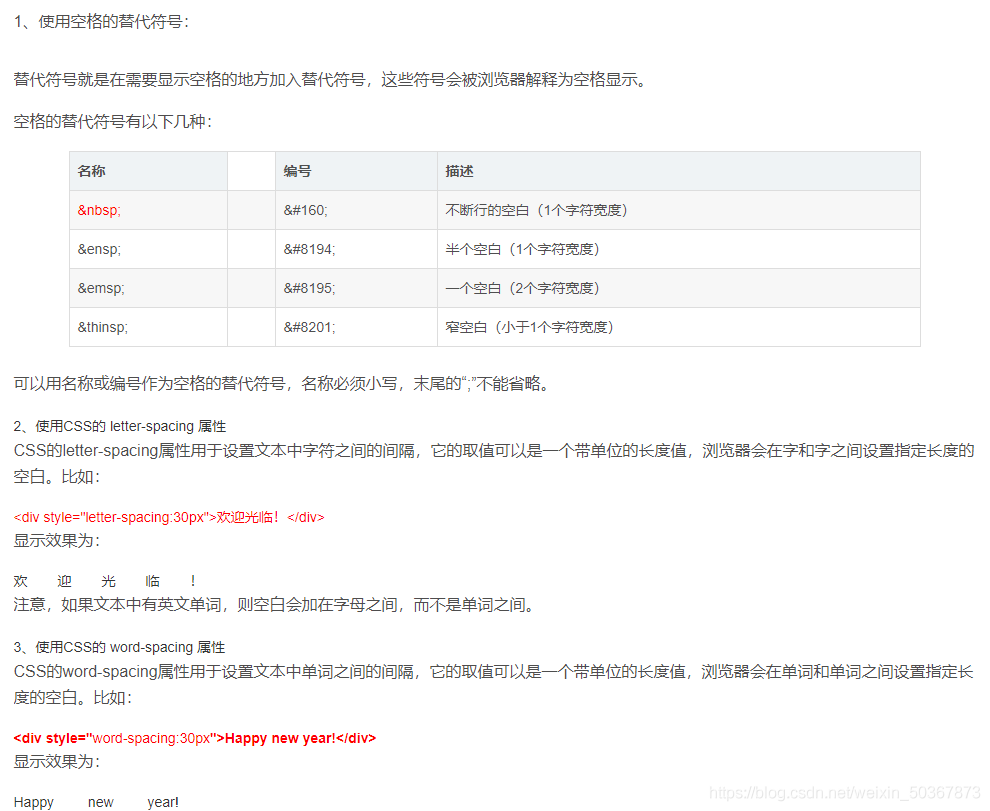
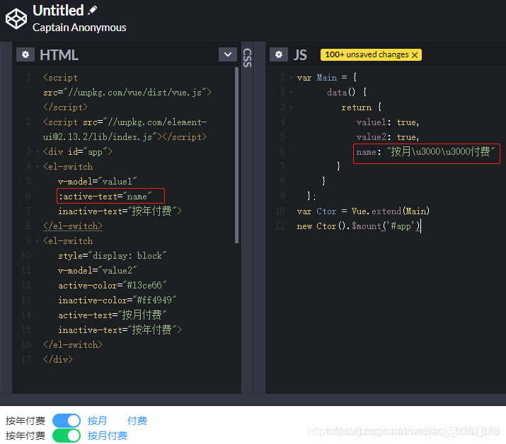

## vue里面的文本空格占位符

下面是几个普通html常用字符：

```html
&nbsp;  空格
&amp;   &
&lt;    <
&gt;    >
&quot;   "

```


vue中空格表示：



三种空格unicode(\u00A0,\u0020,\u3000)表示的区别

1.不间断空格\u00A0,主要用在office中,让一个单词在结尾处不会换行显示,快捷键ctrl+shift+space ;

2.半角空格(英文符号)\u0020,代码中常用的;

3.全角空格(中文符号)\u3000,中文文章中使用;

————————————————
```js
<button>测评报{{ "\xa0" }}名费{{"\xa0\xa0\xa0\xa0\xa0\xa0\xa0"}} </button>
```

转自：https://blog.csdn.net/weixin_50367873/article/details/114269165